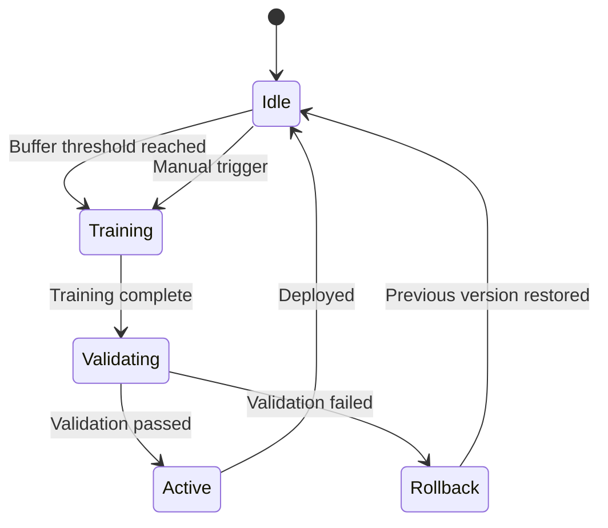

# Policy Status API

Endpoints for monitoring and controlling the reinforcement learning policy.

---

## GET /v1/policy/status

Get the current status of the RL policy including version, performance metrics, and training state.

### Endpoint

```http
GET /v1/policy/status
```

### Headers

| Header | Required | Description |
|--------|----------|-------------|
| `Authorization` | Yes | `Bearer <api-key>` |

### Request Examples

=== "curl"

    ```bash
    curl -X GET https://reinforce-spec-alb-1758221004.us-east-1.elb.amazonaws.com/v1/policy/status \
      -H "Authorization: Bearer $RS_API_KEY"
    ```

=== "Python"

    ```python
    from reinforce_spec_sdk import ReinforceSpecClient

    client = ReinforceSpecClient()
    status = await client.get_policy_status()

    print(f"Version: {status.version}")
    print(f"Accuracy: {status.metrics.selection_accuracy:.1%}")
    ```

### Response (200 OK)

```json
{
  "version": "v001",
  "status": "active",
  "created_at": "2024-01-10T00:00:00Z",
  "updated_at": "2024-01-15T08:30:00Z",
  "metrics": {
    "selection_accuracy": 0.847,
    "average_reward": 0.72,
    "total_selections": 12847,
    "total_feedback": 8923,
    "feedback_rate": 0.694
  },
  "training": {
    "status": "idle",
    "last_trained_at": "2024-01-14T22:00:00Z",
    "replay_buffer_size": 892,
    "next_training_threshold": 1500,
    "total_training_runs": 23
  },
  "config": {
    "learning_rate": 0.0003,
    "entropy_coefficient": 0.01,
    "discount_factor": 0.99,
    "selection_method_default": "hybrid"
  }
}
```

### Response Fields

| Field | Type | Description |
|-------|------|-------------|
| `version` | string | Current policy version |
| `status` | string | `active`, `training`, `degraded` |
| `created_at` | string | When this policy was first created |
| `updated_at` | string | Last modification time |
| `metrics` | object | Performance statistics |
| `metrics.selection_accuracy` | number | How often users agree with selections |
| `metrics.average_reward` | number | Mean reward from feedback |
| `metrics.total_selections` | integer | Total specs evaluated |
| `metrics.total_feedback` | integer | Total feedback submissions |
| `metrics.feedback_rate` | number | Feedback / Selections ratio |
| `training` | object | Training state information |
| `training.status` | string | `idle`, `running`, `failed` |
| `training.replay_buffer_size` | integer | Current buffer size |
| `training.next_training_threshold` | integer | Buffer size to trigger training |
| `config` | object | Policy hyperparameters |

---

## POST /v1/policy/train {#train-policy}

Manually trigger a policy training run. Requires elevated permissions.

### Endpoint

```http
POST /v1/policy/train
```

### Headers

| Header | Required | Description |
|--------|----------|-------------|
| `Authorization` | Yes | `Bearer <api-key>` (admin scope required) |
| `Content-Type` | Yes | `application/json` |

### Body Parameters

| Parameter | Type | Required | Default | Description |
|-----------|------|----------|---------|-------------|
| `force` | boolean | No | `false` | Train even if buffer threshold not met |
| `epochs` | integer | No | `10` | Number of training epochs |
| `batch_size` | integer | No | `64` | Training batch size |

### Request Examples

=== "Default Training"

    ```bash
    curl -X POST https://reinforce-spec-alb-1758221004.us-east-1.elb.amazonaws.com/v1/policy/train \
      -H "Authorization: Bearer $RS_ADMIN_KEY" \
      -H "Content-Type: application/json" \
      -d '{}'
    ```

=== "Force Training"

    ```json
    {
      "force": true,
      "epochs": 20
    }
    ```

### Response (202 Accepted)

```json
{
  "training_job_id": "train_01HQXYZ999JKL",
  "status": "started",
  "replay_buffer_size": 1523,
  "estimated_duration_seconds": 120,
  "started_at": "2024-01-15T12:00:00Z"
}
```

### Response (409 Conflict)

Training already in progress:

```json
{
  "error": "training_in_progress",
  "message": "A training job is already running",
  "details": {
    "current_job_id": "train_01HQXYZ888JKL",
    "started_at": "2024-01-15T11:58:00Z",
    "progress": 0.45
  }
}
```

---

## GET /v1/policy/history

Get historical policy versions and their performance.

### Endpoint

```http
GET /v1/policy/history
```

### Query Parameters

| Parameter | Type | Default | Description |
|-----------|------|---------|-------------|
| `limit` | integer | `10` | Max versions to return |
| `offset` | integer | `0` | Pagination offset |

### Response (200 OK)

```json
{
  "data": [
    {
      "version": "v001",
      "status": "active",
      "created_at": "2024-01-14T22:00:00Z",
      "metrics": {
        "selection_accuracy": 0.847,
        "average_reward": 0.72
      },
      "training_epochs": 10,
      "training_buffer_size": 1523
    },
    {
      "version": "v000",
      "status": "archived",
      "created_at": "2024-01-07T18:00:00Z",
      "metrics": {
        "selection_accuracy": 0.812,
        "average_reward": 0.68
      },
      "training_epochs": 10,
      "training_buffer_size": 1000
    }
  ],
  "pagination": {
    "total": 24,
    "limit": 10,
    "offset": 0,
    "has_more": true
  }
}
```

---

## Errors

| Status | Error Code | Description |
|--------|------------|-------------|
| `401` | `unauthorized` | Missing or invalid API key |
| `403` | `forbidden` | Insufficient permissions for training |
| `409` | `training_in_progress` | Training job already running |
| `503` | `service_unavailable` | Policy service unavailable |

---

## Policy Lifecycle



### Status Descriptions

| Status | Description |
|--------|-------------|
| `active` | Policy is serving requests |
| `training` | Training job in progress |
| `validating` | New policy being validated |
| `degraded` | Fallback to scoring-only mode |

---

## Monitoring Best Practices

### Key Metrics to Track

```python
status = await client.get_policy_status()

# Alert if accuracy drops
if status.metrics.selection_accuracy < 0.7:
    alert("Policy accuracy below threshold")

# Alert if feedback rate is low
if status.metrics.feedback_rate < 0.1:
    alert("Low feedback rate - policy not learning")

# Track training progress
if status.training.status == "running":
    log(f"Training in progress: {status.training.progress:.0%}")
```

### Grafana Dashboard Example

```promql
# Selection accuracy over time
reinforce_spec_policy_accuracy{version="$version"}

# Training frequency
rate(reinforce_spec_policy_training_total[24h])

# Buffer growth rate
rate(reinforce_spec_replay_buffer_size[1h])
```

---

## Related

- [Selection Methods](../concepts/selection-methods.md) — How policies are used
- [Feedback API](feedback.md) — Improve the policy
- [Observability Guide](../guides/observability.md) — Monitoring setup
