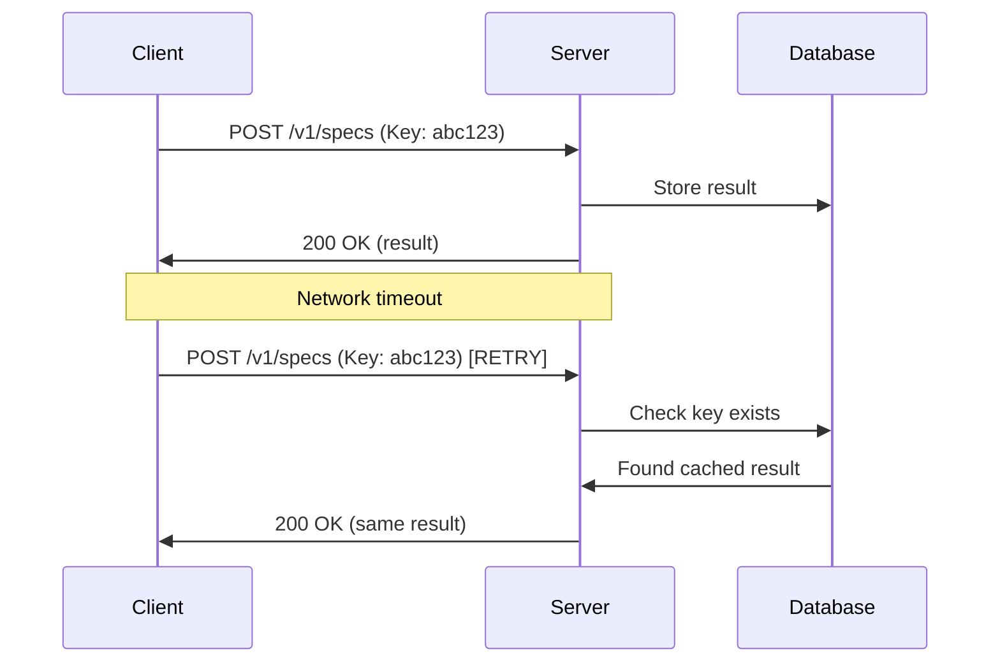

# Idempotency

Idempotency ensures that retrying the same request multiple times produces the same result, enabling safe retries without duplicate processing.

---

## Overview

Network failures happen. Idempotency lets you safely retry requests without worrying about duplicate actions or inconsistent state.



---

## How It Works

### Include an Idempotency Key

Add the `Idempotency-Key` header to your request:

```http
POST /v1/specs HTTP/1.1
Host: api.reinforce-spec.dev
Authorization: Bearer your-api-key
Content-Type: application/json
Idempotency-Key: eval-payment-api-2024-001

{
  "candidates": [...]
}
```

### Key Requirements

| Requirement | Details |
|-------------|---------|
| Format | String, max 256 characters |
| Uniqueness | Must be unique per distinct request |
| Persistence | Keys are stored for 24 hours |
| Characters | Alphanumeric, hyphens, underscores |

### Recommended Key Formats

```python
# UUID (most common)
idempotency_key = str(uuid.uuid4())
# "550e8400-e29b-41d4-a716-446655440000"

# Semantic key (easier to debug)
idempotency_key = f"eval-{user_id}-{timestamp}"
# "eval-user123-1705320060"

# Request-based (deterministic)
idempotency_key = hashlib.sha256(
    json.dumps(request_body, sort_keys=True).encode()
).hexdigest()[:32]
# "a1b2c3d4e5f6..."
```

---

## Behavior

### First Request

```
Request:  POST /v1/specs + Idempotency-Key: key123
Action:   Process request, store result keyed by "key123"
Response: 200 OK + result
```

### Retry with Same Key and Body

```
Request:  POST /v1/specs + Idempotency-Key: key123
Action:   Find cached result for "key123"
Response: 200 OK + same result (from cache)
```

### Same Key, Different Body

```
Request:  POST /v1/specs + Idempotency-Key: key123 + different body
Action:   Detect mismatch
Response: 400 Bad Request + idempotency_mismatch error
```

---

## Implementation Examples

=== "Python SDK"

    ```python
    from reinforce_spec_sdk import ReinforceSpecClient
    import uuid

    client = ReinforceSpecClient()

    # Generate idempotency key
    idempotency_key = str(uuid.uuid4())

    # First attempt
    try:
        result = await client.select(
            candidates=[spec_a, spec_b],
            request_id=idempotency_key,
        )
    except NetworkError:
        # Safe to retry with same key
        result = await client.select(
            candidates=[spec_a, spec_b],
            request_id=idempotency_key,
        )
    ```

=== "Python httpx"

    ```python
    import httpx
    import uuid

    async def evaluate_with_retry(candidates, max_retries=3):
        idempotency_key = str(uuid.uuid4())
        
        for attempt in range(max_retries):
            try:
                async with httpx.AsyncClient() as client:
                    response = await client.post(
                        "https://reinforce-spec-alb-1758221004.us-east-1.elb.amazonaws.com/v1/specs",
                        headers={
                            "Authorization": f"Bearer {api_key}",
                            "Idempotency-Key": idempotency_key,
                        },
                        json={"candidates": candidates},
                        timeout=30.0,
                    )
                    response.raise_for_status()
                    return response.json()
            except (httpx.TimeoutException, httpx.NetworkError):
                if attempt == max_retries - 1:
                    raise
                await asyncio.sleep(2 ** attempt)  # Exponential backoff
    ```

=== "curl"

    ```bash
    # Generate a key
    request_id=$(uuidgen)

    # First attempt
    curl -X POST https://reinforce-spec-alb-1758221004.us-east-1.elb.amazonaws.com/v1/specs \
      -H "Authorization: Bearer $RS_API_KEY" \
      -H "Content-Type: application/json" \
      -H "Idempotency-Key: $IDEMPOTENCY_KEY" \
      -d '{"candidates": [...]}'

    # Retry (same key returns cached result)
    curl -X POST https://reinforce-spec-alb-1758221004.us-east-1.elb.amazonaws.com/v1/specs \
      -H "Authorization: Bearer $RS_API_KEY" \
      -H "Content-Type: application/json" \
      -H "Idempotency-Key: $IDEMPOTENCY_KEY" \
      -d '{"candidates": [...]}'
    ```

---

## Error Handling

### Idempotency Mismatch

If you reuse a key with a different request body:

```json
{
  "error": "idempotency_mismatch",
  "message": "Request body doesn't match previous request with same idempotency key",
  "details": {
    "idempotency_key": "my-key-123",
    "original_hash": "abc123def456",
    "new_hash": "xyz789uvw012"
  }
}
```

**Resolution:** Use a unique idempotency key for each unique request.

### Handling in Code

```python
from reinforce_spec_sdk.exceptions import IdempotencyMismatchError

try:
    result = await client.select(
        candidates=[spec_a, spec_b],
        request_id=key,
    )
except IdempotencyMismatchError as e:
    # Key was used with different body - generate new key
    new_key = str(uuid.uuid4())
    result = await client.select(
        candidates=[spec_a, spec_b],
        request_id=new_key,
    )
```

---

## Best Practices

### Do

✅ **Generate keys client-side**
```python
key = str(uuid.uuid4())  # Client generates
```

✅ **Use semantic keys when helpful**
```python
key = f"process-order-{order_id}"  # Easier debugging
```

✅ **Store keys with your request logs**
```python
logger.info(f"Request sent", extra={
    "idempotency_key": key,
    "request_type": "evaluate",
})
```

✅ **Include in retry logic**
```python
@retry(max_attempts=3)
async def evaluate(candidates, idempotency_key):
    # Same key used across retries
    return await client.select(
        candidates=candidates,
        request_id=idempotency_key,
    )
```

### Don't

❌ **Reuse keys for different requests**
```python
# BAD: Same key for different data
await client.select(candidates_a, request_id="my-key")
await client.select(candidates_b, request_id="my-key")  # Error!
```

❌ **Generate keys server-side after request**
```python
# BAD: Key changes on retry
async def evaluate(candidates):
    key = str(uuid.uuid4())  # Different each time!
    return await client.select(candidates, key)
```

❌ **Use sensitive data in keys**
```python
# BAD: Contains PII
key = f"user-{user_email}-{timestamp}"  # Don't use email
```

---

## Key Lifecycle

```
┌─────────────────────────────────────────────────────────────┐
│                    Idempotency Key Lifecycle                 │
├─────────────────────────────────────────────────────────────┤
│                                                              │
│  T+0        T+24h                                           │
│   │           │                                              │
│   ▼           ▼                                              │
│   ┌───────────┐                                              │
│   │  Active   │────────────────────► Key Expired            │
│   └───────────┘                                              │
│        │                                                     │
│        │ Request with same key                              │
│        ▼                                                     │
│   ┌───────────┐                                              │
│   │  Cached   │ Returns stored result                       │
│   └───────────┘                                              │
│                                                              │
└─────────────────────────────────────────────────────────────┘
```

| State | Duration | Behavior |
|-------|----------|----------|
| Active | 0-24h | Returns cached result |
| Expired | >24h | Key can be reused |

---

## Supported Endpoints

| Endpoint | Idempotency Support |
|----------|---------------------|
| `POST /v1/specs` | ✅ Yes |
| `POST /v1/specs/feedback` | ✅ Yes |
| `POST /v1/policy/train` | ✅ Yes |
| `GET /v1/policy/status` | ❌ No (read-only) |
| `GET /v1/health` | ❌ No (read-only) |

---

## Monitoring

### Check if Response is Cached

The response includes a header indicating if it was served from cache:

```http
X-Idempotency-Replayed: true
```

### Prometheus Metrics

```promql
# Idempotency cache hit rate
rate(reinforce_spec_idempotency_cache_hits_total[5m]) /
rate(reinforce_spec_idempotency_requests_total[5m])

# Keys currently in cache
reinforce_spec_idempotency_keys_active
```

---

## Related

- [API Reference](../api-reference/specs.md) — Using idempotency with endpoints
- [Error Handling](../guides/error-handling.md) — Retry strategies
- [Error Codes](../api-reference/errors.md) — Idempotency errors
