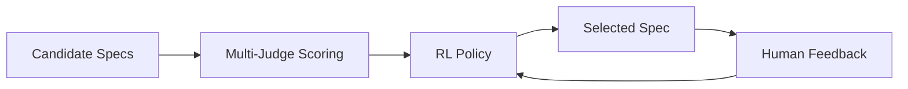
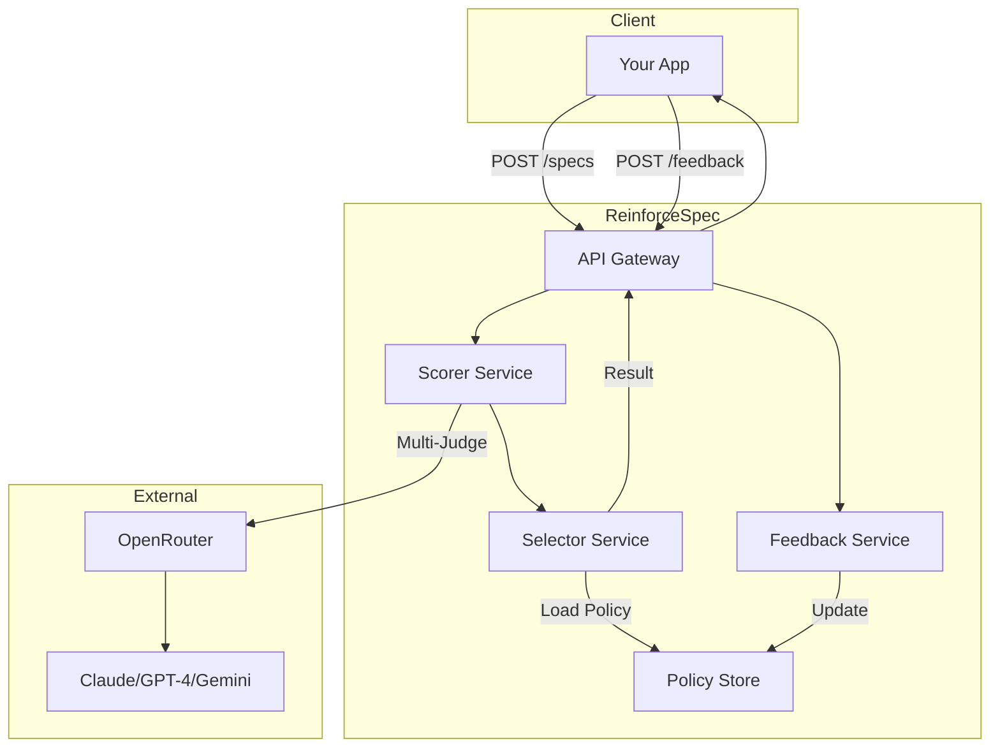

# Core Concepts

Understand the fundamental concepts behind ReinforceSpec's specification evaluation and selection system.

---

## Overview

ReinforceSpec combines three core technologies:



1. **Multi-Judge LLM Scoring** — Evaluates specs across 12 enterprise dimensions
2. **Reinforcement Learning** — Learns from feedback to improve selections
3. **Hybrid Selection** — Combines scoring with RL for optimal results

---

## Key Topics

<div class="grid cards" markdown>

-   :material-chart-box: **[Scoring Dimensions](scoring-dimensions.md)**
    
    The 12 enterprise dimensions used to evaluate specs

-   :material-robot: **[Selection Methods](selection-methods.md)**
    
    How scoring and RL combine to select specs

-   :material-scale-balance: **[Multi-Judge Ensemble](multi-judge.md)**
    
    How multiple LLMs provide robust scoring

-   :material-refresh: **[Idempotency](idempotency.md)**
    
    Safe request retries and caching

</div>

---

## How It Works

### 1. Scoring Phase

When you submit candidate specifications, each one is evaluated by a multi-judge ensemble:

```
┌─────────────────────────────────────────────────────────────┐
│                    Multi-Judge Scoring                       │
├─────────────────────────────────────────────────────────────┤
│                                                              │
│  Spec A ──► Claude 3.5  ──┬── Dimension Scores ──► 0.847    │
│            GPT-4o        ─┤                                  │
│            Gemini Pro    ─┘                                  │
│                                                              │
│  Spec B ──► Claude 3.5  ──┬── Dimension Scores ──► 0.523    │
│            GPT-4o        ─┤                                  │
│            Gemini Pro    ─┘                                  │
│                                                              │
└─────────────────────────────────────────────────────────────┘
```

Each spec receives scores across 12 dimensions (security, compliance, scalability, etc.).

### 2. Selection Phase

The hybrid selector combines raw scores with the RL policy:

```python
# Simplified selection logic
def select(candidates, scores, policy):
    # Scoring component (weighted by dimensions)
    score_ranking = rank_by_composite_score(scores)
    
    # RL component (learned preferences)
    rl_ranking = policy.predict(candidates, context)
    
    # Hybrid combination
    if selection_method == "hybrid":
        final = combine(score_ranking, rl_ranking, weights=[0.6, 0.4])
    elif selection_method == "scoring_only":
        final = score_ranking
    else:  # rl_only
        final = rl_ranking
    
    return final[0]
```

### 3. Feedback Loop

Your feedback improves future selections:

```
┌──────────────────────────────────────────────────────────────┐
│                     Feedback Loop                             │
├──────────────────────────────────────────────────────────────┤
│                                                               │
│   Selection ──► User Review ──► Feedback (+1/-1)             │
│                                      │                        │
│                                      ▼                        │
│                              Replay Buffer                    │
│                                      │                        │
│                                      ▼                        │
│                              Policy Training                  │
│                                      │                        │
│                                      ▼                        │
│                              Better Selections                │
│                                                               │
└──────────────────────────────────────────────────────────────┘
```

---

## Terminology

| Term | Definition |
|------|------------|
| **Candidate** | A specification to be evaluated |
| **Dimension** | An evaluation criterion (e.g., security, scalability) |
| **Composite Score** | Weighted aggregate of all dimension scores |
| **Policy** | The RL model that learns from feedback |
| **Replay Buffer** | Storage of experiences for training |
| **Hybrid Selection** | Combining scoring + RL for selection |

---

## Architecture



---

## Next Steps

- **[Scoring Dimensions](scoring-dimensions.md)** — Deep dive into evaluation criteria
- **[Selection Methods](selection-methods.md)** — Choose the right selection strategy
- **[Quickstart](../getting-started/quickstart.md)** — Try it yourself
