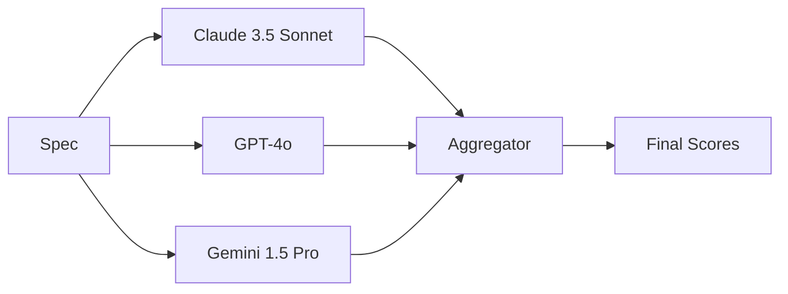
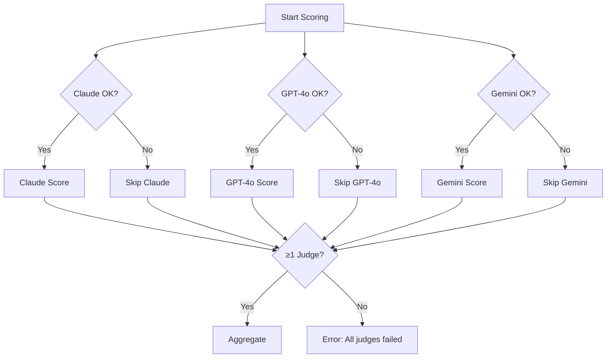

# Multi-Judge LLM Ensemble

ReinforceSpec uses a multi-judge ensemble of leading LLMs to provide robust, unbiased scoring of specifications.

---

## Overview

Instead of relying on a single LLM, ReinforceSpecClient queries multiple models and aggregates their scores:



**Benefits:**

- **Reduced bias** — Different models have different blind spots
- **Higher accuracy** — Consensus scoring is more reliable
- **Resilience** — Fallback if one provider fails

---

## Default Judge Panel

| Model | Provider | Strengths |
|-------|----------|-----------|
| Claude 3.5 Sonnet | Anthropic | Nuanced analysis, safety |
| GPT-4o | OpenAI | Broad knowledge, reasoning |
| Gemini 1.5 Pro | Google | Technical depth, code analysis |

All models are accessed through [OpenRouter](https://openrouter.ai) for unified access and cost management.

---

## How Scoring Works

### 1. Prompt Construction

Each judge receives a structured prompt:

```
You are evaluating a software specification for enterprise use.

SPECIFICATION:
{spec_content}

CONTEXT:
{description}

Score this specification from 0.0 to 1.0 on each dimension:

1. Security (authentication, authorization, encryption)
2. Compliance (regulatory adherence, audit trails)
3. Scalability (horizontal scaling, data partitioning)
...

Respond in JSON format:
{
  "security": 0.85,
  "security_rationale": "Strong OAuth2 implementation...",
  ...
}
```

### 2. Parallel Scoring

Judges score in parallel for speed:

```python
async def score_with_ensemble(spec, judges):
    # Query all judges simultaneously
    results = await asyncio.gather(*[
        judge.score(spec) for judge in judges
    ])
    return results
```

### 3. Score Aggregation

Individual scores are combined using weighted aggregation:

```python
def aggregate_scores(judge_scores, weights):
    aggregated = {}
    
    for dimension in DIMENSIONS:
        scores = [j[dimension] for j in judge_scores]
        
        # Weighted mean with outlier dampening
        aggregated[dimension] = weighted_trimmed_mean(
            scores, 
            weights,
            trim_fraction=0.1,  # Ignore top/bottom 10%
        )
    
    return aggregated
```

---

## Aggregation Methods

### Weighted Mean (Default)

Simple weighted average of judge scores:

```python
score = sum(w * s for w, s in zip(weights, scores)) / sum(weights)
```

### Trimmed Mean

Removes outliers before averaging:

```python
# Remove highest and lowest scores
sorted_scores = sorted(scores)
trimmed = sorted_scores[1:-1]  # Trim 1 from each end
score = mean(trimmed)
```

### Median

Most robust to outliers:

```python
score = median(scores)
```

### Confidence-Weighted

Weight by judge self-reported confidence:

```python
score = sum(s * c for s, c in zip(scores, confidences)) / sum(confidences)
```

---

## Judge Configuration

### Custom Judge Panel

```python
from reinforce_spec_sdk import ReinforceSpecClient, Judge

client = ReinforceSpecClient(
    judges=[
        Judge(
            model="anthropic/claude-3.5-sonnet",
            weight=1.2,  # Higher weight
        ),
        Judge(
            model="openai/gpt-4o",
            weight=1.0,
        ),
        Judge(
            model="google/gemini-1.5-pro",
            weight=0.8,
        ),
    ],
    aggregation="weighted_mean",
)
```

### Single Judge (Cost Optimization)

```python
client = ReinforceSpecClient(
    judges=[
        Judge(model="anthropic/claude-3.5-sonnet"),
    ],
)
```

### Adding More Judges

```python
client = ReinforceSpecClient(
    judges=[
        Judge(model="anthropic/claude-3.5-sonnet"),
        Judge(model="openai/gpt-4o"),
        Judge(model="google/gemini-1.5-pro"),
        Judge(model="meta-llama/llama-3.1-70b-instruct"),  # Add Llama
        Judge(model="mistralai/mixtral-8x22b-instruct"),  # Add Mixtral
    ],
)
```

---

## Model Characteristics

### Scoring Tendencies

Different models have different calibration tendencies:

| Model | Tendency | Adjustment |
|-------|----------|------------|
| Claude 3.5 | Conservative | +0.05 calibration |
| GPT-4o | Slightly optimistic | -0.02 calibration |
| Gemini 1.5 | Variable | ±0.03 calibration |

These calibrations are applied automatically.

### Dimension Strengths

| Dimension | Best Judge | Reason |
|-----------|------------|--------|
| Security | Claude | Strong safety training |
| Code quality | Gemini | Technical depth |
| Documentation | GPT-4o | Clear communication analysis |
| Compliance | Claude | Regulatory knowledge |

---

## Fallback Behavior

If a judge fails, the system continues with remaining judges:



### Minimum Judges

By default, at least 1 judge must succeed:

```python
client = ReinforceSpecClient(
    min_judges=2,  # Require at least 2 judges
)
```

---

## Disagreement Handling

### High Agreement (Consensus)

```json
{
  "security": {
    "claude": 0.85,
    "gpt4o": 0.87,
    "gemini": 0.84,
    "aggregated": 0.853,
    "agreement": "high"
  }
}
```

Agreement is high when standard deviation < 0.1.

### Moderate Disagreement

```json
{
  "scalability": {
    "claude": 0.70,
    "gpt4o": 0.82,
    "gemini": 0.75,
    "aggregated": 0.757,
    "agreement": "moderate"
  }
}
```

Standard deviation between 0.1 and 0.2.

### High Disagreement

```json
{
  "cost_efficiency": {
    "claude": 0.50,
    "gpt4o": 0.80,
    "gemini": 0.65,
    "aggregated": 0.65,
    "agreement": "low",
    "flag": "review_recommended"
  }
}
```

Standard deviation > 0.2 triggers a flag for manual review.

---

## Cost Optimization

### Token Usage per Judge

| Model | Input $/M | Output $/M | Typical Cost |
|-------|-----------|------------|--------------|
| Claude 3.5 | $3.00 | $15.00 | $0.008 |
| GPT-4o | $2.50 | $10.00 | $0.006 |
| Gemini 1.5 | $1.25 | $5.00 | $0.004 |

**3-judge ensemble**: ~$0.018 per spec scored

### Cost Reduction Strategies

1. **Single judge for low-stakes decisions**
   ```python
   client = ReinforceSpecClient(
       judges=[Judge(model="google/gemini-1.5-pro")],
   )
   ```

2. **Use faster models for initial filtering**
   ```python
   # Quick filter with Gemini
   quick_scores = await client.select(
       candidates=many_candidates,
       judges=[Judge(model="google/gemini-1.5-flash")],
   )
   
   # Full ensemble for top candidates
   top_candidates = filter_top_n(quick_scores, n=3)
   final = await client.select(candidates=top_candidates)
   ```

3. **Cache similar specs**
   ```python
   client = ReinforceSpecClient(
       enable_score_cache=True,
       cache_similarity_threshold=0.95,
   )
   ```

---

## Monitoring Judge Performance

### Judge Metrics

```python
status = await client.get_judge_metrics()

for judge in status.judges:
    print(f"{judge.model}:")
    print(f"  Success rate: {judge.success_rate:.1%}")
    print(f"  Avg latency: {judge.avg_latency_ms}ms")
    print(f"  Avg score: {judge.avg_score:.2f}")
    print(f"  Std dev: {judge.score_std_dev:.2f}")
```

### Prometheus Metrics

```promql
# Judge success rate
reinforce_spec_judge_success_rate{model="claude-3.5"}

# Judge latency
histogram_quantile(0.95, reinforce_spec_judge_latency_seconds{model="gpt-4o"})

# Inter-judge agreement
reinforce_spec_judge_agreement_score
```

---

## Related

- [Scoring Dimensions](scoring-dimensions.md) — What's being scored
- [Selection Methods](selection-methods.md) — How scores drive selection
- [OpenRouter Setup](../getting-started/authentication.md) — API key configuration
