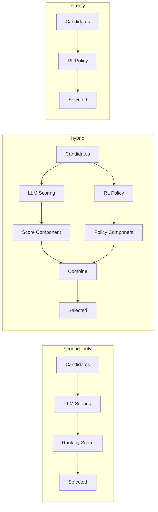
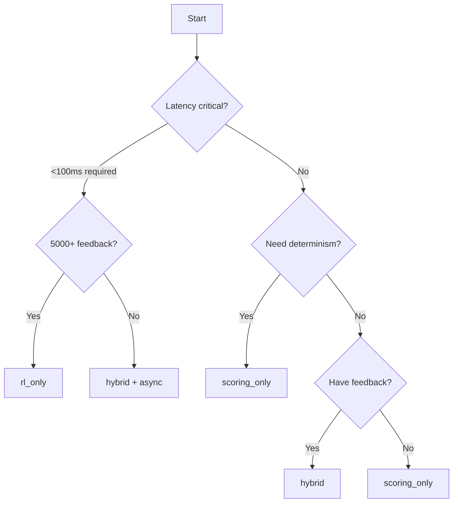

# Selection Methods

ReinforceSpec offers three selection methods that combine LLM scoring with reinforcement learning in different ways.

---

## Overview

| Method | Description | Best For |
|--------|-------------|----------|
| `scoring_only` | Pure LLM-based scoring | Deterministic, explainable results |
| `hybrid` | Scoring + RL policy (default) | Best overall selection quality |
| `rl_only` | RL policy without scoring | After extensive training |



---

## Scoring Only

### How It Works

Uses multi-judge LLM ensemble to score each candidate across 12 dimensions, then selects the highest composite score.

```python
result = await client.select(
    candidates=[spec_a, spec_b, spec_c],
    selection_method="scoring_only",
)
```

### Algorithm

```python
def select_scoring_only(candidates, scores):
    # Calculate composite score for each candidate
    composite_scores = [
        sum(d.score * d.weight for d in dimensions)
        for scores in candidate_scores
    ]
    
    # Select highest score
    return candidates[argmax(composite_scores)]
```

### Characteristics

| Property | Value |
|----------|-------|
| Deterministic | Yes (same input → same output) |
| Explainable | High (score breakdown available) |
| Adapts to feedback | No |
| Latency | ~2-3 seconds per candidate |
| Token usage | Higher (LLM calls) |

### When to Use

- ✅ Need reproducible results
- ✅ Audit requirements demand explainability
- ✅ New deployment without training data
- ✅ Debugging or comparing against RL selection

---

## Hybrid Selection (Default)

### How It Works

Combines LLM scoring with RL policy predictions. The policy learns from feedback to adjust selections beyond pure scoring.

```python
result = await client.select(
    candidates=[spec_a, spec_b, spec_c],
    selection_method="hybrid",  # Default
)
```

### Algorithm

```python
def select_hybrid(candidates, scores, policy, alpha=0.6):
    # Score component (60% weight by default)
    score_probs = softmax(composite_scores)
    
    # RL component (40% weight by default)
    policy_probs = policy.predict_proba(candidates, context)
    
    # Combine
    combined_probs = alpha * score_probs + (1 - alpha) * policy_probs
    
    # Select highest combined probability
    return candidates[argmax(combined_probs)]
```

### Characteristics

| Property | Value |
|----------|-------|
| Deterministic | No (policy may vary) |
| Explainable | Medium (scores + policy contribution) |
| Adapts to feedback | Yes |
| Latency | ~2-3 seconds per candidate |
| Token usage | Higher (LLM calls) |

### When to Use

- ✅ General production use
- ✅ Want continuous improvement from feedback
- ✅ Balance between scoring and learned preferences
- ✅ Domain-specific selection patterns

### Adjusting the Mix

The `alpha` parameter controls the balance:

```python
# More weight on scoring (conservative)
client = ReinforceSpecClient(hybrid_alpha=0.8)

# More weight on RL (trust the learned policy)
client = ReinforceSpecClient(hybrid_alpha=0.4)
```

| Alpha | Behavior |
|-------|----------|
| `1.0` | Pure scoring (same as `scoring_only`) |
| `0.8` | Conservative (80% scoring, 20% RL) |
| `0.6` | Balanced (default) |
| `0.4` | RL-leaning (40% scoring, 60% RL) |
| `0.0` | Pure RL (same as `rl_only`) |

---

## RL Only

### How It Works

Uses only the reinforcement learning policy for selection, without LLM scoring. Much faster but requires substantial training.

```python
result = await client.select(
    candidates=[spec_a, spec_b, spec_c],
    selection_method="rl_only",
)
```

### Algorithm

```python
def select_rl_only(candidates, policy):
    # Encode candidates
    embeddings = policy.encoder(candidates)
    
    # Get action probabilities from policy
    probs = policy.actor(embeddings)
    
    # Select (deterministic in production, sampled during training)
    return candidates[argmax(probs)]
```

### Characteristics

| Property | Value |
|----------|-------|
| Deterministic | Yes (greedy selection) |
| Explainable | Low (neural network) |
| Adapts to feedback | Yes |
| Latency | ~50-100ms |
| Token usage | None |

### When to Use

- ✅ High-throughput scenarios
- ✅ Latency-critical applications
- ✅ After 5000+ feedback samples
- ✅ Cost optimization (no LLM calls)

### Requirements

`rl_only` requires a trained policy:

```python
status = await client.get_policy_status()

if status.metrics.total_feedback < 5000:
    print("Warning: Insufficient training data for rl_only")
    print(f"Current: {status.metrics.total_feedback}")
    print("Recommended: 5000+")
```

---

## Selection Method Comparison

### Decision Matrix

| Factor | scoring_only | hybrid | rl_only |
|--------|--------------|--------|---------|
| **Quality** | High | Highest | Medium-High* |
| **Speed** | Slow | Slow | Fast |
| **Cost** | High | High | Low |
| **Explainability** | High | Medium | Low |
| **Adapts** | No | Yes | Yes |
| **Cold start** | ✅ Works | ✅ Works | ❌ Needs data |

*After sufficient training

### Performance Benchmarks

| Method | P50 Latency | P99 Latency | LLM Cost/req |
|--------|-------------|-------------|--------------|
| `scoring_only` | 2.1s | 4.8s | $0.015 |
| `hybrid` | 2.2s | 5.0s | $0.015 |
| `rl_only` | 45ms | 120ms | $0.00 |

### Quality Over Training Time

```
Selection Quality
     ^
1.0  │                    ╭────────── scoring_only
     │               ╭────┤
0.9  │          ╭────┤    │
     │     ╭────┤    │    ╰────────── hybrid
0.8  │╭────┤    │    │
     ││    │    ╰────────────────── rl_only
0.7  ││    │
     │╰────┘
0.6  │
     └────────────────────────────────►
     0    1k   2k   5k   10k  20k
              Feedback Samples
```

---

## Selecting the Right Method

### Decision Flowchart



### Use Case Examples

#### Enterprise SaaS (Hybrid)

```python
# Default for most production use cases
client = ReinforceSpecClient(
    selection_method="hybrid",
    hybrid_alpha=0.6,
)
```

#### Compliance-Critical (Scoring Only)

```python
# Auditable, reproducible selections
client = ReinforceSpecClient(
    selection_method="scoring_only",
    dimension_weights={"compliance": 0.25, "security": 0.25},
)
```

#### High-Throughput API (RL Only)

```python
# After training, switch to RL for speed
async def select_spec(candidates):
    # Check if policy is ready
    status = await client.get_policy_status()
    
    method = (
        "rl_only" 
        if status.metrics.total_feedback > 5000 
        else "hybrid"
    )
    
    return await client.select(
        candidates=candidates,
        selection_method=method,
    )
```

---

## Gradual Migration

Start with `hybrid`, migrate to `rl_only` as training data accumulates:

```python
class AdaptiveSelector:
    def __init__(self, client):
        self.client = client
        self.rl_threshold = 5000
    
    async def select(self, candidates):
        status = await self.client.get_policy_status()
        feedback_count = status.metrics.total_feedback
        
        if feedback_count < 1000:
            # Cold start: rely on scoring
            method = "scoring_only"
        elif feedback_count < self.rl_threshold:
            # Building up: use hybrid
            method = "hybrid"
        else:
            # Mature: use RL for speed
            method = "rl_only"
        
        return await self.client.select(
            candidates=candidates,
            selection_method=method,
        )
```

---

## Related

- [Scoring Dimensions](scoring-dimensions.md) — What scoring evaluates
- [Multi-Judge Ensemble](multi-judge.md) — How scoring works
- [Feedback Loop Guide](../guides/feedback-loop.md) — Training the RL policy
