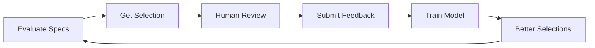

# Feedback Loop Guide

Learn how to set up an effective feedback loop to continuously improve ReinforceSpec's selection quality.

---

## Overview

The feedback loop is how ReinforceSpec learns from your decisions:



Every piece of feedback makes future selections more aligned with your preferences.

---

## Quick Start

### Basic Feedback

```python
from reinforce_spec_sdk import ReinforceSpecClient

client = ReinforceSpecClient()

# Step 1: Evaluate
result = await client.select(
    candidates=[spec_a, spec_b],
)

# Step 2: User reviews and decides
user_approved = await get_user_approval(result.selected)

# Step 3: Submit feedback
await client.submit_feedback(
    request_id=result.request_id,
    selected_index=result.selected.index,
    reward=1.0 if user_approved else -0.5,
)
```

---

## Reward Signal Design

### Reward Scale

| Value | Meaning | When to Use |
|-------|---------|-------------|
| `1.0` | Perfect | Selection was exactly right |
| `0.5` | Good | Selection was helpful but not perfect |
| `0.0` | Neutral | Acceptable but could be better |
| `-0.5` | Poor | Wrong selection, had to revise |
| `-1.0` | Terrible | Completely wrong choice |

### Binary Feedback (Simple)

```python
# Thumbs up / thumbs down
await client.submit_feedback(
    request_id=result.request_id,
    selected_index=result.selected.index,
    reward=1.0 if user_liked else -1.0,
    feedback_type="thumbs_up" if user_liked else "thumbs_down",
)
```

### Granular Feedback (Better)

```python
# 5-star rating converted to reward
def stars_to_reward(stars: int) -> float:
    return (stars - 3) / 2  # 1★=-1.0, 3★=0.0, 5★=1.0

await client.submit_feedback(
    request_id=result.request_id,
    selected_index=result.selected.index,
    reward=stars_to_reward(user_rating),
    feedback_type="rating",
)
```

### Outcome-Based Feedback (Best)

```python
# Based on actual production outcomes
def calculate_reward(outcome: dict) -> float:
    reward = 0.0
    
    # Did the spec work in production?
    if outcome["deployed_successfully"]:
        reward += 0.4
    
    # Were there issues?
    reward -= 0.1 * len(outcome["issues_found"])
    
    # Stakeholder satisfaction
    reward += (outcome["satisfaction_score"] - 3) / 5
    
    return max(-1.0, min(1.0, reward))

await client.submit_feedback(
    request_id=result.request_id,
    selected_index=result.selected.index,
    reward=calculate_reward(production_outcome),
    feedback_type="explicit",
    actual_outcome=production_outcome,
)
```

---

## Feedback Collection Patterns

### Immediate UI Feedback

Collect feedback right after selection:

```python
# In your UI handler
async def handle_selection_approval(
    request_id: str,
    approved: bool,
    comment: str = "",
):
    await client.submit_feedback(
        request_id=request_id,
        selected_index=0,
        reward=0.8 if approved else -0.3,
        comment=comment,
    )
```

### Delayed Review Feedback

Collect feedback after expert review:

```python
# Async review process
async def submit_review_feedback(
    request_id: str,
    review: ReviewResult,
):
    reward = calculate_review_score(review)
    
    await client.submit_feedback(
        request_id=request_id,
        selected_index=0,
        reward=reward,
        feedback_type="rating",
        comment=review.summary,
        metadata={
            "reviewer": review.reviewer_id,
            "review_duration_minutes": review.duration,
        },
    )
```

### Automated Production Feedback

Collect feedback from production metrics:

```python
# Scheduled job checks production outcomes
async def collect_production_feedback():
    # Get selections from last week
    recent_selections = await get_recent_selections(days=7)
    
    for selection in recent_selections:
        # Check if spec was deployed
        deployment = await check_deployment(selection.spec_id)
        
        if deployment:
            # Calculate reward from production metrics
            metrics = await get_production_metrics(deployment.id)
            reward = calculate_production_reward(metrics)
            
            await client.submit_feedback(
                request_id=selection.request_id,
                selected_index=selection.selected_index,
                reward=reward,
                feedback_type="explicit",
                actual_outcome={
                    "deployment_id": deployment.id,
                    "error_rate": metrics.error_rate,
                    "latency_p99": metrics.latency_p99,
                    "user_satisfaction": metrics.satisfaction,
                },
            )
```

---

## Feedback Quality

### Good Feedback Characteristics

| Characteristic | Impact |
|----------------|--------|
| **Consistent** | Same criteria across reviews |
| **Timely** | Submit soon after decision |
| **Contextual** | Include relevant details |
| **Calibrated** | Full range of values used |

### Improving Feedback Quality

```python
# Include context for better learning
await client.submit_feedback(
    request_id=result.request_id,
    selected_index=result.selected.index,
    reward=0.6,
    comment="Good overall but missing rate limiting",
    actual_outcome={
        "dimensions_modified": ["security", "scalability"],
        "modification_effort": "low",
        "final_satisfaction": 4,
    },
)
```

### Feedback Calibration

Ensure your reward signals span the full range:

```python
class FeedbackCalibrator:
    def __init__(self, window_size: int = 100):
        self.recent_rewards = deque(maxlen=window_size)
    
    def calibrate(self, raw_reward: float) -> float:
        self.recent_rewards.append(raw_reward)
        
        if len(self.recent_rewards) < 10:
            return raw_reward
        
        # Warn if rewards are too uniform
        std = statistics.stdev(self.recent_rewards)
        if std < 0.2:
            logging.warning(
                f"Reward variance too low ({std:.2f}). "
                "Consider using full reward range."
            )
        
        return raw_reward

calibrator = FeedbackCalibrator()

await client.submit_feedback(
    request_id=request_id,
    selected_index=0,
    reward=calibrator.calibrate(user_rating),
)
```

---

## Training Pipeline

### Automatic Training

Training triggers automatically when the replay buffer reaches threshold:

```python
# Check training status
status = await client.get_policy_status()

print(f"Buffer size: {status.training.replay_buffer_size}")
print(f"Next training at: {status.training.next_training_threshold}")
print(f"Training status: {status.training.status}")
```

### Manual Training

Trigger training on demand (requires admin permissions):

```python
# Force training with current buffer
await client.trigger_training(force=True)
```

### Monitor Training Progress

```python
async def wait_for_training():
    while True:
        status = await client.get_policy_status()
        
        if status.training.status == "idle":
            print("Training complete!")
            print(f"New accuracy: {status.metrics.selection_accuracy:.1%}")
            break
        elif status.training.status == "running":
            print(f"Training in progress...")
        else:
            print(f"Status: {status.training.status}")
        
        await asyncio.sleep(30)
```

---

## Measuring Improvement

### Track Accuracy Over Time

```python
async def log_accuracy_metrics():
    status = await client.get_policy_status()
    
    metrics = {
        "timestamp": datetime.now().isoformat(),
        "accuracy": status.metrics.selection_accuracy,
        "avg_reward": status.metrics.average_reward,
        "total_feedback": status.metrics.total_feedback,
        "policy_version": status.version,
    }
    
    # Log to your monitoring system
    logger.info("Policy metrics", extra=metrics)
    
    # Alert if accuracy drops
    if status.metrics.selection_accuracy < 0.7:
        alert("Selection accuracy below threshold!")
```

### A/B Testing

Compare selection methods:

```python
import random

async def evaluate_with_ab_test(candidates):
    # 80% hybrid, 20% scoring_only
    method = "hybrid" if random.random() < 0.8 else "scoring_only"
    
    result = await client.select(
        candidates=candidates,
        selection_method=method,
    )
    
    # Track for analysis
    log_experiment(
        experiment="selection_method",
        variant=method,
        request_id=result.request_id,
    )
    
    return result
```

---

## Best Practices

### Do

✅ **Submit feedback consistently**
```python
# Always submit feedback, even for neutral outcomes
if selection_used:
    await client.submit_feedback(
        request_id=request_id,
        selected_index=0,
        reward=calculate_reward(outcome),
    )
```

✅ **Use the full reward range**
```python
# Good: varied rewards
rewards = [1.0, 0.7, 0.3, -0.2, -0.5, 0.8, 0.5]

# Bad: only extremes
rewards = [1.0, 1.0, -1.0, 1.0, -1.0]
```

✅ **Include context**
```python
await client.submit_feedback(
    request_id=request_id,
    selected_index=0,
    reward=0.5,
    comment="Good security, weak scalability section",
)
```

### Don't

❌ **Ignore negative cases**
```python
# Bad: only feedback when happy
if user_happy:
    await client.submit_feedback(reward=1.0)
# Missing: negative feedback when unhappy
```

❌ **Submit duplicate feedback**
```python
# Bad: multiple feedback for same request
await client.submit_feedback(request_id=req, reward=0.5)
await client.submit_feedback(request_id=req, reward=0.8)  # Error!
```

❌ **Delay indefinitely**
```python
# Bad: feedback weeks later
# Good: feedback within 24 hours of decision
```

---

## Troubleshooting

### Low Feedback Rate

```python
status = await client.get_policy_status()

if status.metrics.feedback_rate < 0.1:
    print("Warning: Low feedback rate")
    print("Suggestions:")
    print("  - Add feedback prompts in UI")
    print("  - Automate outcome-based feedback")
    print("  - Reduce friction in feedback flow")
```

### Accuracy Not Improving

```python
# Check feedback distribution
stats = await client.get_feedback_stats()

print(f"Positive feedback: {stats.positive_rate:.1%}")
print(f"Negative feedback: {stats.negative_rate:.1%}")
print(f"Neutral feedback: {stats.neutral_rate:.1%}")

if stats.positive_rate > 0.9:
    print("Warning: Feedback too positive - model can't learn to improve")
```

---

## Related

- [Submit Feedback API](../api-reference/feedback.md) — API reference
- [Policy Status API](../api-reference/policy.md) — Monitor training
- [Selection Methods](../concepts/selection-methods.md) — How RL is used
